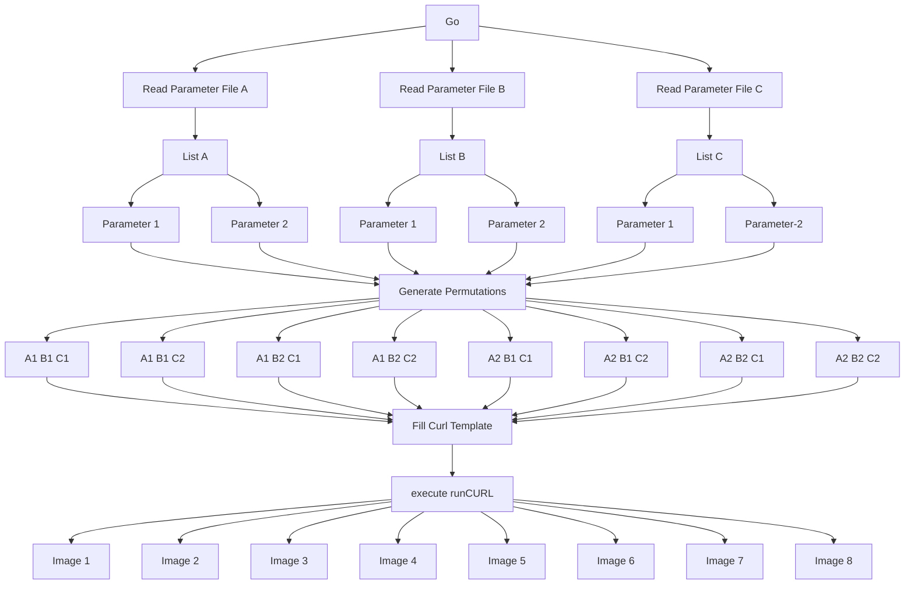

### Fooocus-API-XYZ: Variable Parameter Image Generator for Fooocus-API
Generates a series of Fooocus images with unrestricted user supplied parameter variations. 

`Requires Fooocus-API installed and running.`


#### Quick Start


Get it:
```bash
git clone https://github.com/daedon/Fooocus-API-XYZ
```
Run it:
```bash
cd Fooocus-API-XYZ
python3 xyz.py myJob
```
Create a new job:
```bash
cd Fooocus-API-XYZ
python3 xyz.py jobName
```
The first time you reference/use a jobName:
* A directory with the job's name will be created in "Fooocus-API-XYZ/jobs".
* Associated sub-directories will be created.
* Default files will be copied to "jobs/jobName".
* You can Add, Modify, Delete the job's parameters in "jobs/jobName/parms".
* Customize the curl template "jobs/jobName/curl.template" (each job has it's own template).
* Set default parameters for `all new jobs created` by editing the default files in the `default_` directories.

##### Example with 3 variable parameters

Parameter files are located in the `../Fooocus-API-XYZ/jobs/myJob/parms` directory. The table below contains 5 parameters from the demo job.
The first 3 characters of the parameter file name serve to sort and determine the order the parameters are processed.
In the example below, resolution, guidance_scale and sharpness will automatically be used to build `save_name` since they vary (have more than one value).
"steps" has only one value and won't vary but will be included in `save_name` since it ends with an "_". 
All permutations of the following parameters will be used to make curl calls to Fooocus-API. 

| FILE NAME       | _0_steps\_       | _1_resolution    |_2_guidance_scale|  _3_sharpness | ___image_number |
| ----------------| ---------------- | ---------------- |---------------- |----------------|---------------- |
| line 1 in file  | 25               |   512*640        | 4.0             |  2.0           |      1          |
| line 2 in file  |                  |   640*640        | 4.5             |  3.0           |                 |
| line 3 in file  |                  | 1024*1024        |                 |                |                 |

The parameters in the table above will produce the following `save_names`:
```
myJob_0001_steps_25_resolution_512x512_guidance_scale_4.0_sharpness_2.0_<time stamp>
myJob_0002_steps_25_resolution_512x512_guidance_scale_4.0_sharpness_3.0_<time stamp>
myJob_0003_steps_25_resolution_512x512_guidance_scale_4.5_sharpness_2.0_<time stamp>
myJob_0004_steps_25_resolution_512x512_guidance_scale_4.5_sharpness_3.0_<time stamp>
myJob_0005_steps_25_resolution_640x640_guidance_scale_4.0_sharpness_2.0_<time stamp>
myJob_0006_steps_25_resolution_640x640_guidance_scale_4.0_sharpness_3.0_<time stamp>
myJob_0007_steps_25_resolution_640x640_guidance_scale_4.5_sharpness_2.0_<time stamp>
myJob_0008_steps_25_resolution_640x640_guidance_scale_4.5_sharpness_3.0_<time stamp>
myJob_0009_steps_25_resolution_1024x1024_guidance_scale_4.0_sharpness_2.0_<time stamp>
myJob_0010_steps_25_resolution_1024x1024_guidance_scale_4.0_sharpness_3.0_<time stamp>
myJob_0011_steps_25_resolution_1024x1024_guidance_scale_4.5_sharpness_2.0_<time stamp>
myJob_0012_steps_25_resolution_1024x1024_guidance_scale_4.5_sharpness_3.0_<time stamp>
```

`save_name` can be configured with `saveNameCFG` in config.py.
When `saveNameCFG` is 1 or 2, parameters with more than 1 value will automatically be included in `save_name`.
To force the inclusion of a parameter with only one value, terminate the parameter's file name with an "_", eg `___seed_`.
```
saveNameCFG = 0: save_name contains jobName, image number and time stamp. 
saveNameCFG = 1: save_name contains also the variable parameter value.
saveNameCFG = 2: save_name contains both the variable parameter name and value.

0: myJob_0001_024844
1: myJob_0001_25_512x512_4.0_2.0_<time stamp>
2: myJob_0001_steps_25_resolution_512x512_guidance_scale_4.0_sharpness_2.0_<time stamp>
```
Separators for save_name can be modified in `config.py`. 
Note the separator `----` between the parameters and the `=` between the paramater names and their value.
```
myJob_0001----steps=25----resolution=512x512----guidance_scale=4.0----sharpness=2.0----<time stamp>
```
#### Summary: 
* Fooocus-API-XYZ requires that `Fooocus-API` be running.
* Fooocus-API-XYZ is data driven. 
* Reads parameter values from parameter files in the job's `parms` subdirectory.
* Each parameter file represents a Fooocus parameter: eg, `___steps`, `___resolution`, `___prompt`, `___base_model`.
* The 1st character of each parameter file name must be an underscore "_".
* The 1st 3 characters of each parameter file name are used for documentation and sorting purposes only. 
* The 1st 3 characters of each parameter file are discarded.
* Parameter files are read in alphabetical order, hence the first 3 characters decide the order of the parameters.
* Empty lines in Parameter files are ignored.
* Lines beginning with a "#" Parameter files are comments and ignored.
* No parameter values are read after a line with a "." in parameter files.
* Each parameter file line represents 1 value for that parameter.
* Parameters are read line by line into lists matching the parameter names.
* Permutations of all the parameter values are generated.
* The curl template has substitution parameters matching the paramater file names.
* The curl template can be customized for each individual job (see Customzing below).
* For each permutation, fills the curl template with the current iteration's values (`___parameter`).
* The current iteration of `curl.template` is written to `runCURL`.
* `runCURL` is made executable and executed.

#### Configuring

Directory locations and other parameters can be changed in `config.py`.

If `image_number` is set to N, Fooocus will generate N images per curl call with sequential seed numbers.
To reduce repetiion in large permuations and create N images with random seeds, insert N lines in `___seed` each with a `-1`.


#### Customizing

The curl template has close to 100 parameters, only a dozen or so are set up by default.

For example, `sampler_name` is hard coded in the curl job template. 
```
"sampler_name": "dpmpp_2m_sde_gpu",
```
To make `sampler_name` one of your variable parameters in myJob,
* edit myJob's curl.template and replace `dpmpp_2m_sde_gpu` with `___sampler_name` (keep the quotes).
```
"sampler_name": "___sampler_name",
```
* In the `myJob/parms` directory, create a file named `___sampler_name` with your sampler_name values.
* Generate your images.
* To have `sampler_name` as a varable parameter in all future jobs, make the above changes to the defaults directories.





